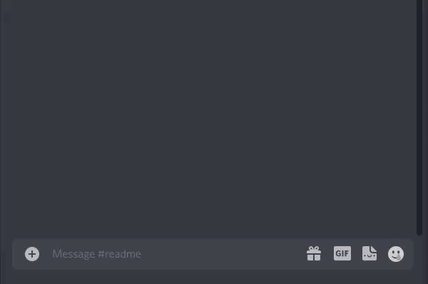
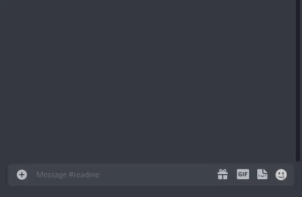
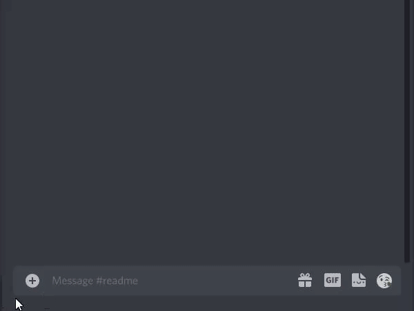
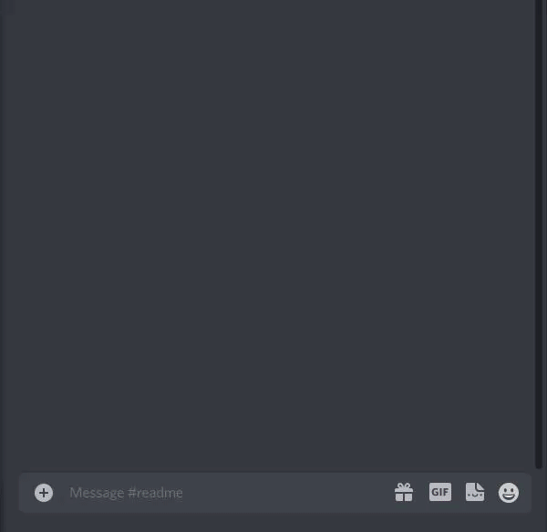
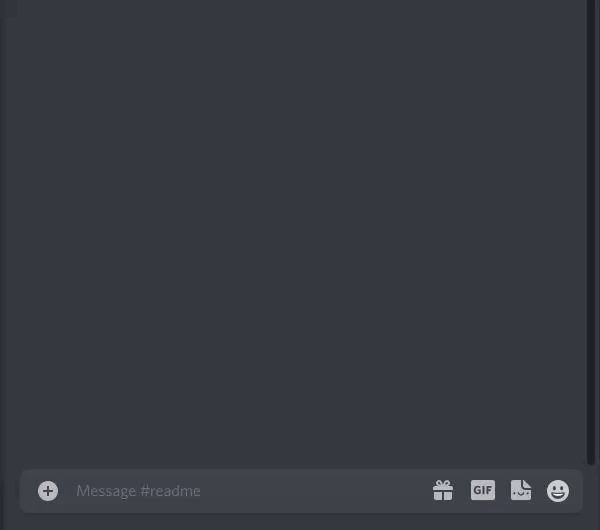
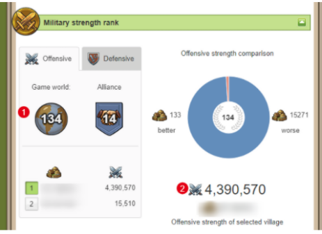

# CoordToLink

[Русский](https://github.com/dankadolba/CoordToLinkBot/blob/master/README.md) [English](https://github.com/dankadolba/CoordToLinkBot/blob/master/README.en.md)
## Description and commands usage example

---

### !spam

!spam command creates a button which contain link with pre-prepared troops, spam type and coordinates.

```text
!spam 0 0 19+1
!spam 0 0 17+1+1+1
```



---

### !troops

!troops command create a button which contain link without troops but with coordinates.

```text
!troops 0 0
```



---

### !overview

!overview or !o commands create button which contain link to village overview.

```text
!overview 0 0
!o 0 0
```


---

### !market

!market or !push commands create button which contain link to market with pre-prepared coords.

```text
!market 0 0
!push 0 0
```


---

### !hero

!hero commands create list which contain equipped hero items.
Known issue - some combinations of browser and OS version dont have easy access to hero link (safari/iOS12).

```text
!hero link
```



---

### !tr

!tr command create button which adding trade routes after click. Trade routes will be created only from villa which are active now.

```text
!tr villaId wood clay iron crop hh:mm mode every
```

> villaId - internal village Id, player can saw it in villages link (newdid):  
  
wood, clay, iron, crop - count of res for routes;  
mode - type of routes,  **send** - "send at" or **deliver** - "deliver at";  
hh:mm - hours and minutes which will use for "send at" or "deliver at" mode;
every - repeat every hours, value which allowed **1**, **2**, **3**, **4**, **6**, **8**, **12**, **24**;


---

### !herotracker

!herotracker command needed to checking when hero item was changed and inform user if any item was changed and shows the list of changes.
Works only for link which added / Bot dont collect any info from game.

```text
!herotracker link nickname
```

> link -  Link to hero image. From PC player can gain that link using "Copy image address", on mobile devices player can do the same with long tap to hero image and "copy image link"
nickname - nickname of player



---

### !spamlist

!spamlist command create list of link which contain pre-prepared troops, spam type and coordinates. Each new target should be added to new string.

```text
!spamlist xCoord yCoord type
xCoord yCoord type
xCoord yCoord type
```

> xCoord, yCoord - x/y
type - spam troops **19+1** or **17+1+1+1**.



---

### !off

!off command neeed just adding information about off position and off strength. Dont have any reply from bot. Each off should be added into separated message. That needed only for artifact def prediction command. Now that works only with info which be actual in artifact spawn day so if you want to do prediction earlier you must add strength points which that off will up in time. The off order doesnt matter for adding.

```text
!off position power
```

> position - off position in global rank.  
power - off strength in global rank. Should be a number (doesnt work with ",").


---

### !offclear

!offclear command delete all info about offs.

---

### !artidef

!artidef command do prediction about artifact def based on previously added info about off. Only first 100 off are matter for prediction.


---
### !help

!help command give link to this page.

---

## How to use

### Settings

For using that bot you should set bot token and server link to config.json file.

```text
{
    "token": "copy-paste token value here",
    "server": "server link"
}
```

For adding that bot you should [create own bot in Discord site](https://discordjs.guide/preparations/setting-up-a-bot-application.html#creating-your-bot), copy token value from "Bot" page and paste it to config.json.
Server link should be ending with ".com/"

---

### Launch

You should upload that bot to any hosting. For example you can use [heroku](https://devcenter.heroku.com/articles/git). Or you can launch it from local pc.
