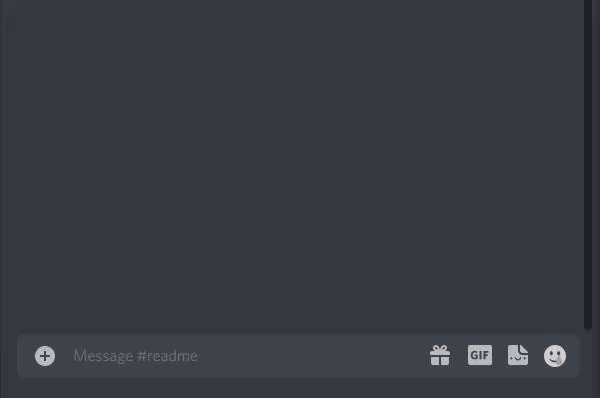
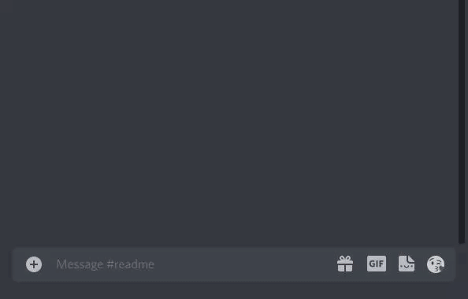
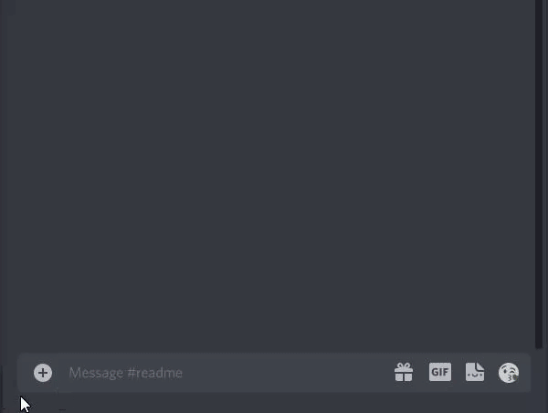
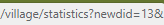
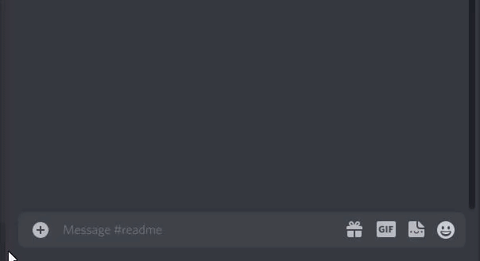
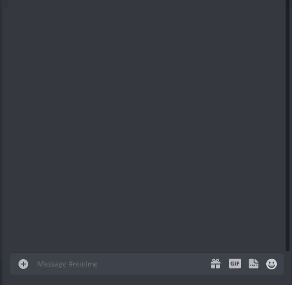
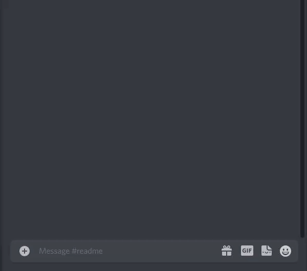
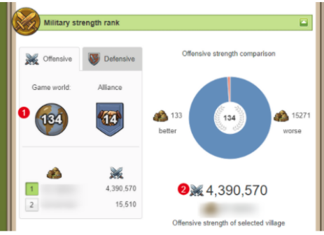

# CoordToLink

## Описание и примеры команд

---

### !spam

Команда !spam создает кнопку со ссылкой с заранее введенными войсками, видом спама и указанными координатами.

```text
!spam 0 0 19+1
!spam 0 0 17+1+1+1
```



---

### !troops

Команда !troops создает кнопку со ссылкой без введенных войск и указанными координатами.

```text
!troops 0 0
```


---

### !overview

Команда !overview или !o создает кнопку со ссылкой ведущей на обзор деревни.

```text
!overview 0 0
!o 0 0
```


---

### !market

Команда !market или !push создает кнопку со ссылкой на рынок с введенными координатами.

```text
!market 0 0
!push 0 0
```



---

### !hero

Команда !hero выводит список вещей которые в данный момент находятся на герое по ссылке на его изображение.

```text
!hero link
```



---

### !tr

Команда !tr создает кнопку со ссылкой, которая создает торговые пути. Торговые пути создаются из деревни в которой сейчас находится игрок.

```text
!tr villaId wood clay iron crop hh:mm mode every
```

> villaId - внутрений номер деревни, который можно взять из ссылки на деревню (newdid):  
  
wood, clay, iron, crop - числовое количество дерева/глины/железа/кропа;  
mode - вид отправки, возможные значения **send** - "отправить в" или **deliver** - "доставить к";  
hh:mm - часы и минуты для времени отправки/прихода в зависимости от значения mode;  
every - частота отправки, возможные значения **1**, **2**, **3**, **4**, **6**, **8**, **12**, **24**;



---

### !herotracker

Команда !herotracker проверяет наличие изменений в вещах героя по его ссылке и имени, и при их наличии сообщает об этом.

```text
!herotracker link nickname
```

> link - ссылка на изображение героя. В браузере ее можно получить через пкм по изображению и "Копировать ссылку на изображение", в мобильном браузере сделать долгий тап по изображению героя и скопировать ссылку на изображение.  
nickname - ник игрока



---

### !spamlist

Команда !spamlist создает кнопки со ссылкой с заранее введенными войсками, видом спама и указанными координатами. Каждая новая цель должна быть на новой строке.

```text
!spamlist xCoord yCoord type
xCoord yCoord type
xCoord yCoord type
```

> xCoord, yCoord - координаты цели.  
type - тип спама **19+1** или **17+1+1+1**.



---

### !off

Команда !off позволяет добавить позицию и силу оффа. Не имеет "ответа" от бота. Каждый офф нужно добавлять отдельным сообщением. Необходимо для оценки дефа на артефактах, поэтому если значение вводится раньше, то стоит самостоятельно досчитать количество очков атаки которые "достроятся" за это время. Порядок ввода оффов не важен, в дальнейшем используются только оффы из топ100.

```text
!off position power
```

> position - позиция оффа в глобальном рейтинге.  
power - сила атаки в глобальном рейтинге. Вводить необходимо число без запятых.


---

### !offclear

Команда !offclear удаляет информацию обо всех ранее введенных оффах

---

### !artidef

Команда !artidef дает примерную оценку дефа на артефактах на основе введенных оффов. На данный момент не имеет параметров.


---

## Как использовать

### Первичные настройки

Файл с настройками - config.json.

```text
{
    "token": "copy-paste token value here",
    "server": "server link"
}
```

Для использования бота нужно [создать приложение в дискорде](https://discordjs.guide/preparations/setting-up-a-bot-application.html#creating-your-bot), скорпировать значение токена в разделе "Bot" и вставить его в файл настроек.  
В поле server нужно добавить ссылку на сервер, которая будет заканчиваться ".com/"

---

### Запуск

Можно использовать любой хостинг, например [heroku](https://devcenter.heroku.com/articles/git), запускать бота локально.
